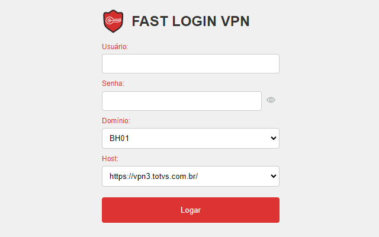

# Fast Login VPN TOTVS - Extensão para Chrome

## Visão Geral
**Fast Login VPN TOTVS** é uma extensão para Chrome projetada para oferecer aos usuários serviços seguros e rápidos de VPN. Ideal para profissionais que buscam uma solução confiável e fácil de usar para acesso remoto seguro e proteção de dados online.

## Recursos
- Acesso rápido e seguro a redes VPN
- Proteção de dados com criptografia avançada
- Interface de usuário simples e intuitiva
- Suporte para múltiplas localizações de servidor

## Instalação
1. Abra o Google Chrome.
2. Visite a Chrome Web Store.
3. Pesquise por "Fast Login VPN TOTVS".
4. Clique em "Adicionar ao Chrome" para instalar a extensão.

[Download da Extensão Fast Login VPN TOTVS](https://chromewebstore.google.com/detail/fast-login-vpn-totvs/bneedhabfahemgpihnjflnpeogmpalpc?hl=pt-BR)

## Uso
- A extensão é fácil de ativar diretamente na barra de ferramentas do Chrome.
- Escolha o servidor de sua preferência e conecte-se com um clique.

## Privacidade e Segurança
- A extensão adota rigorosas políticas de privacidade e não armazena registros de atividade dos usuários.
- Utiliza criptografia de ponta para garantir a segurança dos dados.

## Suporte
- Para suporte, entre em contato através de [email de suporte] ou visite nosso [website de suporte].

## Contribuindo
- Interessados em contribuir podem verificar nossa [página de contribuições no GitHub].

## Licença
- Esta extensão é distribuída sob a licença Apache License 2.0.

## Agradecimentos
- Agradecemos a todos os colaboradores e usuários da extensão Fast Login VPN TOTVS.
